<div align="center">


</div>

**Generate → Gate → Detect → Measure.**

Scotoma is an offline adversarial testing layer for payment fraud detection. It manufactures attacks across six payment rails, refuses to score them unless they survive a six-layer realism gate, detects them with a calibrated three-channel model, and returns whatever evaded into the next round.
The output is not a leaderboard score. It is a map of the attacks a detector cannot see.

<div align="center">


</div>

> Scotoma measures and shrinks a detector's blind spots. It does not claim to make anyone monotonically safer.

Every figure below is a screenshot of the running application, produced by [`docs/capture_screenshots.mjs`](docs/capture_screenshots.mjs) against a live dev server. Nothing is mocked, redrawn or annotated after the fact.

---

## Table of contents

- [Overview](#overview)
- [Why this is different](#why-this-is-different)
- [The money shot](#the-money-shot)
- [Product walkthrough](#product-walkthrough)
- [Interactive demo](#interactive-demo)
- [System architecture](#system-architecture)
- [Repository structure](#repository-structure)
- [The pipeline](#the-pipeline)
- [The fidelity gate](#the-fidelity-gate)
- [Algorithms](#algorithms)
- [Visual gallery](#visual-gallery)
- [Technology stack](#technology-stack)
- [Installation](#installation)
- [Running](#running)
- [API contract](#api-contract)
- [Feature matrix](#feature-matrix)
- [Performance](#performance)
- [Design system](#design-system)
- [Data flow](#data-flow)
- [State management](#state-management)
- [Roadmap](#roadmap)
- [Acknowledgements](#acknowledgements)
- [Citation](#citation)
- [License](#license)

---

## Overview

A fraud model is validated against the fraud that has already been seen. That is a sound way to measure yesterday and a poor way to anticipate tomorrow. A detector can hold excellent aggregate metrics while being structurally blind to an attack class no historical label covers, and the blind spot is usually discovered when it is exploited at volume.

The state of the art handles this with more labels and better features. Both help, and neither addresses the case where the attack class does not exist in any label set. Agent-initiated commerce is the sharp example: payment mandates, attestations and cart hashes have no historical corpus at all, because the standards defining them are still arriving.

**What that leaves open is measurement.** If you cannot enumerate what a model fails to see, you cannot prioritise what to fix. Scotoma generates adversarial traffic, tests whether it is realistic enough to be worth scoring, and reports which vectors the detector misses at per-vector granularity.

---

## Why this is different

| Axis | Existing approach | **Scotoma** |
|---|---|---|
| Test data | Historical labelled fraud | Generated campaigns across 6 rails, 12 live injector classes |
| Realism check | Marginal distributions, TSTR | Six layers, one rotated into shadow each round so it cannot be tuned against |
| Self-criticism | Quality metrics reported by the generator's author | The gate rejects the project's own GaussianCopula ablation on 5 of 6 layers |
| Failure reporting | Single aggregate PR-AUC | Per-vector recall, published including the vectors at 0.0099 |
| Circularity defence | Random train/test split | A vector family plus an entity cohort that never enter any training pool |
| Graph modelling | Ship a GNN, assert lift | Measure lift, get −0.2092 against a 0.03 bar, disable the channel |
| Visibility | One institution's view | The same detector refitted under issuer, acquirer and network masks |
| Threshold | Fixed score cut | Elkan cost-optimal τ* over a 999-point grid and a 4-band ladder |

---

## The money shot

The hardest claim in synthetic data is that the data is realistic. Scotoma answers it by running a standard row-independent generator through its own gate and publishing the result.

<div align="center">
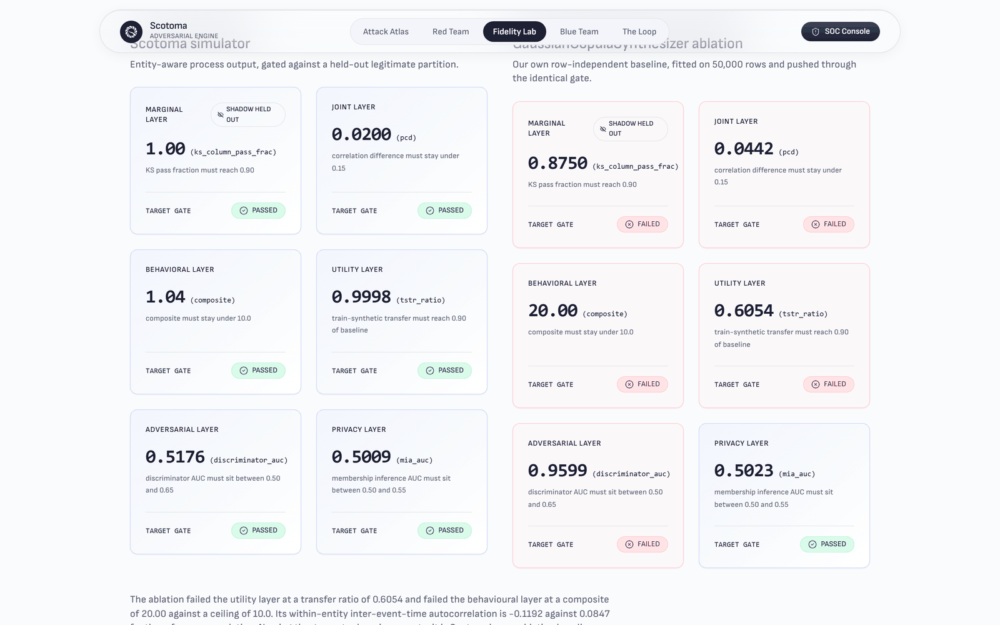
</div>

> **Scotoma:** marginal 1.00, joint 0.0200, behavioural 1.04, utility 0.9998, adversarial 0.5176, privacy 0.5009 — **six of six PASSED**
> **GaussianCopula ablation:** marginal 0.8750, joint 0.0442, behavioural 20.00, utility 0.6054, adversarial 0.9599 — **five of six FAILED**

The ablation's discriminator AUC of **0.9599** means a classifier separates its output from real traffic almost perfectly. Its lag-1 inter-event-time autocorrelation is **−0.1192** against a reference of 0.0847: row-independent generation does not merely weaken within-entity timing structure, it inverts it.

**A quality gate that has never rejected anything is a decoration.** This one rejects data produced by the same repository that built it, and the failure is on the page rather than in a footnote.

---

## Product walkthrough

### 1. Attack Atlas — `/atlas`

The registry: **32 vectors across 6 rails**, of which **12 have live simulators**, printed as **37.5% coverage**. The twenty without generators are greyed rather than omitted, and the recall column carries the measured number for every live vector.

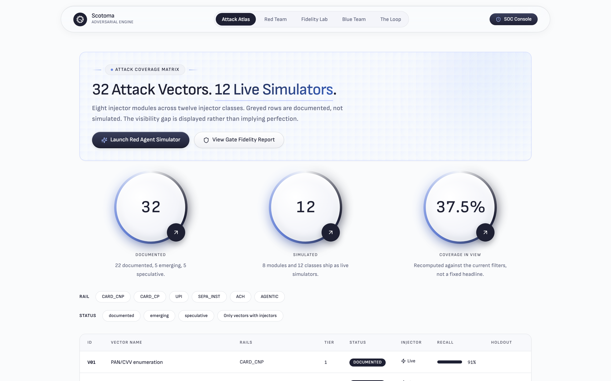

The honest range is visible in one column: **V06 UPI collect-request and mandate abuse at 97%** against **V28 Mule-network orchestration at 1%**. **V07 Synthetic identity at scale** carries a `HOLDOUT` badge and scores **20%**; it never enters any training pool.

- **Implementation:** [`frontend/app/atlas/page.tsx`](frontend/app/atlas/page.tsx), [`components/AtlasExplorer.tsx`](frontend/components/AtlasExplorer.tsx), [`components/VectorTable.tsx`](frontend/components/VectorTable.tsx), [`components/StatPortrait.tsx`](frontend/components/StatPortrait.tsx). Data from [`backend/registry/loader.py`](backend/registry/loader.py) and [`backend/registry/coverage.py`](backend/registry/coverage.py).
- **Interaction:** rail and status chips filter the table and recompute the coverage circle, which is why it is labelled *coverage in view* rather than a fixed headline. Clicking a row opens the vector detail panel.

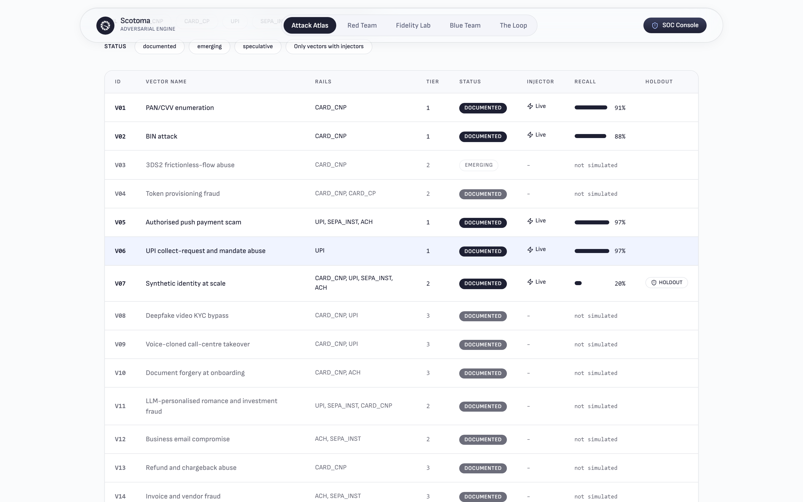

### 2. Red Team console — `/redteam`

Replays **31 recorded events** from `sse_log.jsonl`. The agent proposes parameter sets for pre-built simulators; a constraint validator accepts or refuses each one before anything is realised.

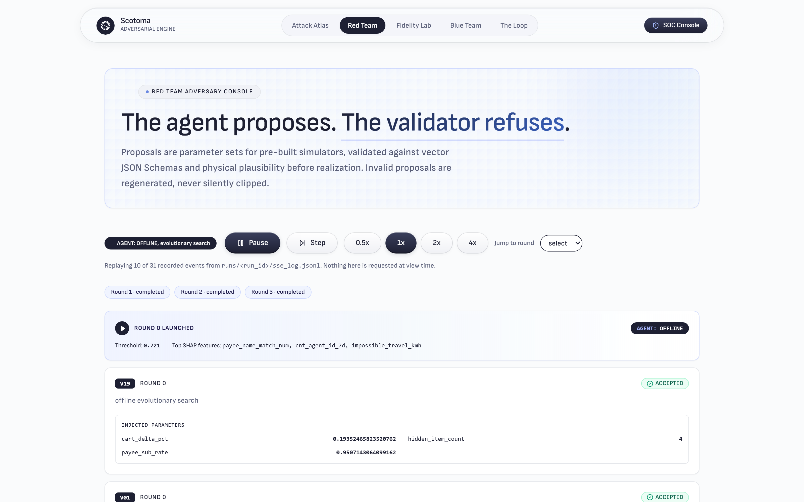

Each accepted proposal shows its injected parameters verbatim, for example V19 at `cart_delta_pct 0.1935`, `hidden_item_count 4`, `payee_sub_rate 0.9507`. The header carries the detector state the agent conditioned on: threshold **0.721**, top SHAP features `payee_name_match_num`, `cnt_agent_id_7d`, `impossible_travel_kmh`.

- **Implementation:** [`components/ReplayConsole.tsx`](frontend/components/ReplayConsole.tsx), [`components/ProposalStream.tsx`](frontend/components/ProposalStream.tsx). Producers: [`backend/generate/red_agent/client.py`](backend/generate/red_agent/client.py), [`offline_search.py`](backend/generate/red_agent/offline_search.py), [`constraints.py`](backend/generate/red_agent/constraints.py).
- **Interaction:** transport controls at 0.5×, 1×, 2×, 4× with pause and step; a round selector jumps the replay. Nothing is requested at view time.

### 3. Fidelity Lab — `/fidelity`

Six layers per round, with the shadow layer marked `SHADOW HELD OUT`. See [The money shot](#the-money-shot) for the ablation comparison.

- **Implementation:** [`components/FidelityExplorer.tsx`](frontend/components/FidelityExplorer.tsx), [`components/GateCardGrid.tsx`](frontend/components/GateCardGrid.tsx), [`components/AblationComparison.tsx`](frontend/components/AblationComparison.tsx). Producer: [`backend/fidelity/gate.py`](backend/fidelity/gate.py).
- **Interaction:** round tabs 1–3 swap the grid; each card names its statistic, its threshold and its verdict.

### 4. Blue Team console — `/soc`

The four-band mitigation ladder over the committed alert queue: **0 approve, 0 step-up, 63 hold, 137 decline** at the default threshold **0.74**, against an Elkan optimum of **0.92**.

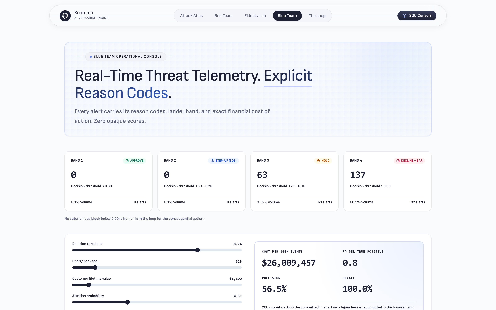

Every alert carries reason codes with the SHAP contribution that produced them, for example `R070 Beneficiary name did not match the account record`, `payee_name_match_num = -1.000 · SHAP 2.650`.

- **Implementation:** [`components/AlertQueue.tsx`](frontend/components/AlertQueue.tsx), [`components/ReasonCodes.tsx`](frontend/components/ReasonCodes.tsx), [`components/CostDial.tsx`](frontend/components/CostDial.tsx), [`components/LadderBands.tsx`](frontend/components/LadderBands.tsx). Producers: [`backend/defend/cost.py`](backend/defend/cost.py), [`backend/defend/ladder.py`](backend/defend/ladder.py), [`backend/defend/explain.py`](backend/defend/explain.py).
- **Interaction:** dragging the decision threshold recomputes cost, precision, recall and FP:TP **in the browser** from 200 committed rows. No network call is made.

### 5. The Loop — `/loop`

Round-over-round evasion, false-positive rate and the fidelity composite on one axis pair, with the blind holdout plotted beside the active campaign.

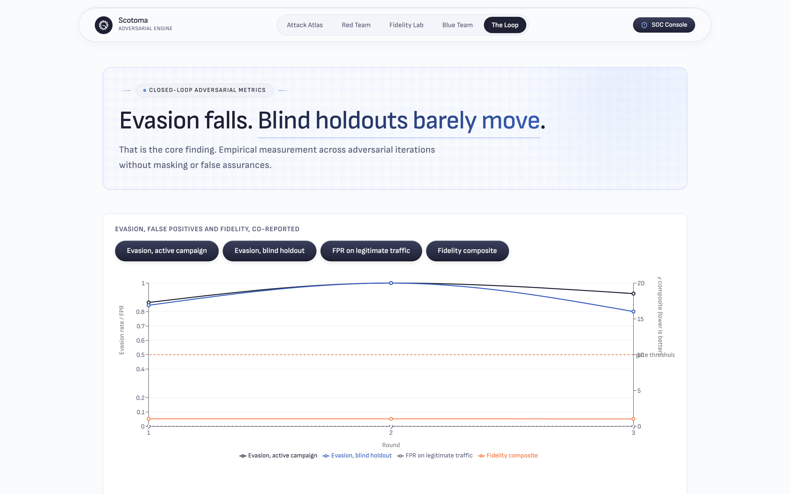

Below it, the party-scope projection: the same detector refitted under three visibility masks. **V06 reaches 0.735 at network scope and is not observable at issuer or acquirer scope at all.**

- **Implementation:** [`components/MoneyChart.tsx`](frontend/components/MoneyChart.tsx), [`components/ScopeMatrix.tsx`](frontend/components/ScopeMatrix.tsx), [`components/GnnResultCard.tsx`](frontend/components/GnnResultCard.tsx), [`components/HonestyCallout.tsx`](frontend/components/HonestyCallout.tsx). Producers: [`backend/loop/controller.py`](backend/loop/controller.py), [`backend/defend/scopes.py`](backend/defend/scopes.py).
- **Interaction:** scope chips highlight a column of the matrix; the graph-channel card prints the measured lift against its kill rule.

---

## Interactive demo

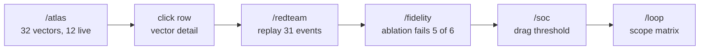

1. Land on `/atlas`. Three counters roll to **32**, **12** and **37.5%**.
2. Scan the recall column. **97%** and **1%** sit four rows apart.
3. Click **V06**. The detail panel opens with the vector's rails, tier and injector path.
4. Open **Red Team**. The replay is already running through 31 recorded events.
5. Open **Fidelity Lab**. Scroll to the ablation. Five red `FAILED` verdicts.
6. Open **Blue Team**. Drag the threshold; cost and FP:TP recompute with no request.
7. Open **The Loop**. The scope matrix shows V06 invisible below network scope.

---

## System architecture

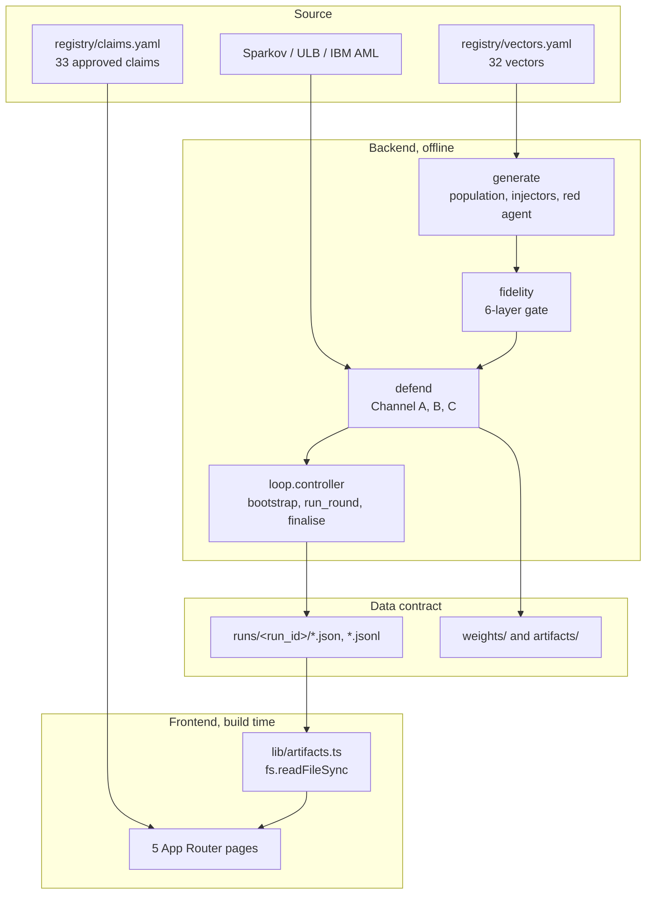

**Modules.**

- `backend/registry` — vector and claim loading, schema validation, coverage matrix.
- `backend/generate` — entity population, NHPP arrivals, 8 injector modules, red agent.
- `backend/fidelity` — the six gate layers plus the GaussianCopula ablation.
- `backend/defend` — features, three channels, calibration, Elkan threshold, SHAP, ladder.
- `backend/loop` — round orchestration and metric persistence.
- `backend/realdata` — Sparkov, ULB and IBM AML adapters.
- `backend/schema` — the canonical event schema and the three party projections.
- `backend/api` — FastAPI surface, 7 endpoints and an SSE stream.

---

## Repository structure

```
backend/
  registry/
    vectors.yaml            # 32 attack vectors, rails, tiers, injector paths
    claims.yaml             # 33 approved claim strings, enforced by tests
    loader.py               # load_vectors, resolve_injector, schema validation
    coverage.py             # build_coverage, coverage_for_run
  generate/
    population.py           # entity population, power-law merchant graph
    behavior.py             # emit_legitimate, NHPP thinned arrivals
    injectors/              # 8 modules, 12 injector classes
    red_agent/
      client.py             # propose, Gemini function calling
      offline_search.py     # evolutionary fallback, no network
      constraints.py        # partition_valid, JSON-schema validation
  fidelity/
    gate.py                 # run_gate, ROTATED_LAYERS shadow rotation
    marginal.py joint.py behavioral.py adversarial.py privacy.py utility.py
    ablation.py             # run_ablation, the GaussianCopula baseline
  defend/
    features.py             # FEATURE_NAMES, 151 features
    windows.py              # rolling_by_key, closed="left"
    gbdt.py                 # fit_channel_a, Platt calibration, reliability_curve
    anomaly.py              # fit_channel_c, isolation forest
    graph_channel.py        # fit_channel_b, neighbour aggregation
    cost.py                 # Elkan matrix, optimal_threshold, cost_per_100k
    ladder.py               # 4-band mitigation ladder
    explain.py              # interventional TreeSHAP, reason codes
    ensemble.py             # Detector.fit, evaluate, export_onnx
  loop/controller.py        # bootstrap, run_round, finalise, _real_floor_reference
  realdata/                 # sparkov.py, ulb.py, aml.py, featurize.py, train.py
  schema/                   # ces.py canonical event, projections.py party masks
  api/                      # app.py and 5 route modules
frontend/
  app/{atlas,redteam,fidelity,soc,loop}/page.tsx
  components/              # 30 components
  lib/artifacts.ts         # readJson, readJsonl, build-time disk reads
  data/run/                # the committed artefacts the screens render
runs/2026-08-31-final/     # the committed run
weights/                   # channel_a_lgbm.txt, channel_c_iforest.joblib, MODEL_CARD.md
docs/capture_screenshots.mjs
tests/                     # 11 test modules
```

---

## The pipeline

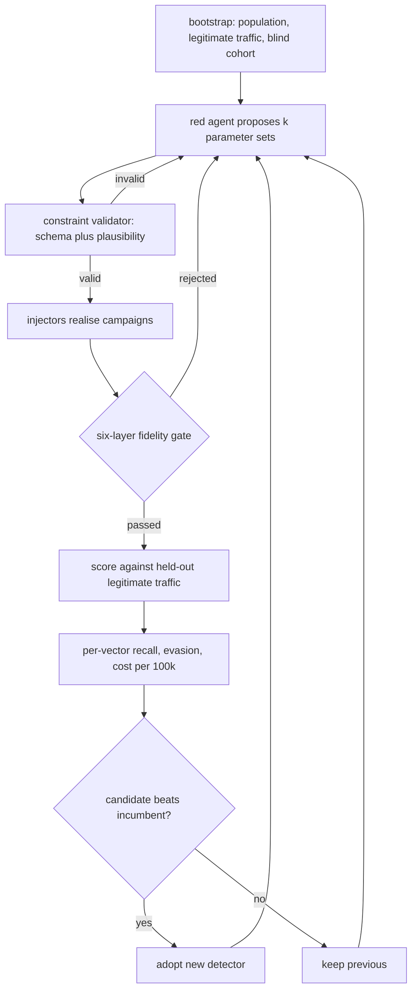

---

## The fidelity gate

The proprietary contribution. Six layers, each with a published threshold, and **one of the marginal, joint and adversarial layers is rotated into shadow every round** so a generator cannot be tuned against a fixed set of six checks.

| Layer | Statistic | Threshold | Scotoma | Ablation |
|---|---|---:|---:|---:|
| Marginal | worst KS | ≤ 0.10 | 0.0117 | 0.1970 |
| Joint | pairwise correlation difference | ≤ 0.15 | 0.0200 | 0.0442 |
| Joint | max Cramér V delta | reported | 0.0028 | 0.5444 |
| Behavioural | composite degradation | < 10.0 | 1.0389 | **20.00** |
| Behavioural | lag-1 IET autocorrelation | positive | 0.0843 | **−0.1192** |
| Adversarial | discriminator AUC | ≤ 0.65 | 0.5176 | **0.9599** |
| Privacy | membership inference AUC | ≤ 0.55 | 0.5009 | 0.5023 |
| Utility | TSTR ratio | ≥ 0.90 | 0.9998 | **0.6054** |

The behavioural composite is a geometric mean, so one catastrophic ratio cannot be averaged away by five healthy ones:

```
composite = exp( mean( ln(r_i) ) )   over ratios r_i
r_key     = max( σ_ref / σ_batch , σ_batch / σ_ref )   per entity key
```

A structural collapse is not a ratio at all, so it sets the composite directly rather than being diluted. Keys absent from the reference corpus are skipped and reported as `not_comparable_keys` rather than scored as failures.

---

## Algorithms

### Elkan cost-optimal threshold

```
C_FP(amount) = amount × merchant_margin + p_attrition × customer_ltv
C_FN(amount) = amount + chargeback_fee
τ*           = C_FP / (C_FP + C_FN)
```

With the shipped constants `chargeback_fee = 25.0`, `merchant_margin = 0.22`, `p_attrition = 0.32`, `customer_ltv = 1800.0`, a 100.00 transaction gives:

```
C_FP = 100 × 0.22 + 0.32 × 1800 = 22 + 576 = 598.0
C_FN = 100 + 25                 = 125.0
τ*   = 598 / (598 + 125)        = 0.827
```

The empirical threshold is chosen by minimising expected cost over `THRESHOLD_GRID = linspace(0.001, 0.999, 999)`. Complexity O(999·n). Inputs: labels, scores, amounts, cost matrix. Output: a scalar threshold and `cost_per_100k`.

**Why cost, not F1.** F1 assumes a false positive and a false negative are equally expensive. Here a false positive destroys `0.32 × 1800 = 576.00` of expected lifetime value plus lost margin, while a false negative costs the transaction amount plus a 25.00 fee. At small amounts the false positive is roughly five times more expensive. A threshold tuned on F1 optimises a quantity the business does not have.

### Point-in-time velocity features

7 entity keys × 5 windows × 4 aggregations = **140 of the 151 features**.

```
bounds(key, w)   : index range covering [t − w, t)      per key group
value(i)         : aggregate over bounds, closed="left"
```

Complexity O(n log n) per key-window pair, from a single `lexsort` plus a vectorised `searchsorted`; group boundaries are separated on a synthetic axis so no loop over millions of groups is needed.

**Why `closed="left"`, not a centred window.** Including the current row lets a count contain the event it is scoring. `tests/test_realdata.py::test_velocity_excludes_the_current_row` asserts a card's first ever transaction has a prior 7-day count of zero. Without that exclusion every velocity feature is a label leak and every downstream number is fiction.

### Platt scaling over isotonic regression

Measured on ULB, the one genuinely observed corpus used here, at a 0.173% base rate:

| Method | PR-AUC | Brier | ECE | Worst populated bin | Scores pinned at 0 or 1 |
|---|---:|---:|---:|---:|---:|
| uncalibrated | 0.7366 | 0.000465 | 0.000439 | 0.0460 | 0.0000 |
| **Platt** | **0.7366** | 0.000480 | **0.000172** | **0.0215** | 0.0000 |
| isotonic | 0.7115 | 0.000466 | 0.000181 | 0.0500 | 0.0256 |

**Why Platt, not isotonic.** Sigmoid is monotonic, so PR-AUC is identical to uncalibrated: calibration costs no ranking. Isotonic costs **0.0251 PR-AUC** and pins 2.56% of scores at exactly 0 or 1. A posterior of exactly 1.0 asserts certainty, and the Elkan threshold has no way to price certainty.

### Channel B gating

```
lift = PR-AUC(with graph features) − PR-AUC(without)
keep = lift ≥ gnn_min_lift_prauc      # 0.03
```

Measured lift in the committed run: **−0.2092**. The channel disabled itself. Scoped separately against IBM AML HI-Small (515,080 accounts, 5,078,345 edges), a degree-and-reciprocity baseline reaches only **0.0074** PR-AUC lift over the base rate.

**Why a pre-registered bar, not a judgement call.** A bar fixed before the measurement cannot be moved after seeing the number.

---

## Visual gallery

| | |
|---|---|
| <br>**Attack Atlas.** 32 vectors, 12 live, the gap displayed. | <br>**Red Team.** 31 recorded events, proposals and refusals. |
| <br>**Fidelity Lab.** The ablation, five of six layers failed. | <br>**Blue Team.** Bands, reason codes, live cost. |
| 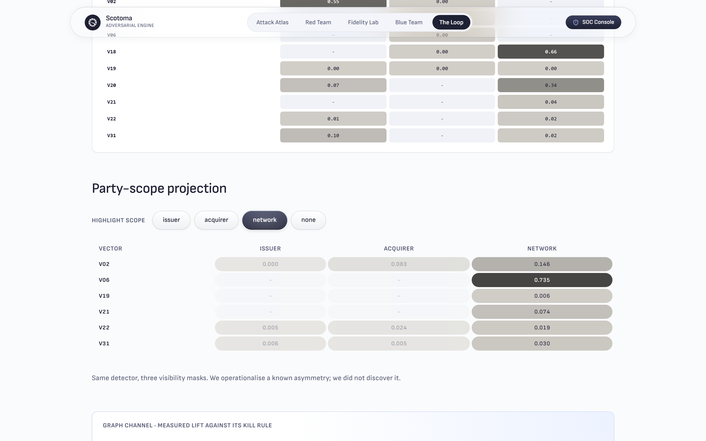<br>**Party scope.** Network-only visibility highlighted. | 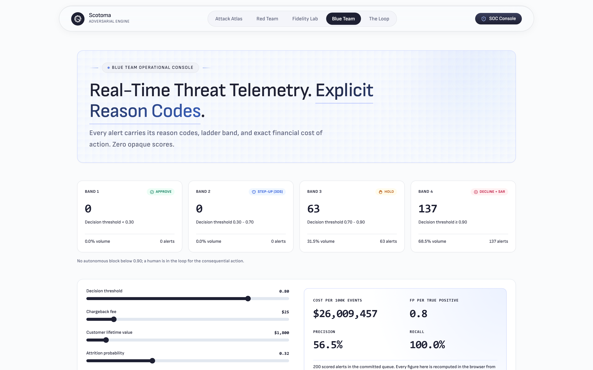<br>**Threshold moved.** Recomputed in-browser. |

---

## Technology stack

| Layer | Technology |
|---|---|
| Detection | LightGBM 4.5.0, scikit-learn 1.5.2, SHAP 0.46.0 |
| Inference | ONNX 1.18.0, onnxruntime 1.19.2, onnxmltools 1.14.0 |
| Synthesis | SDV 1.17.0, NumPy 1.26.4, SciPy 1.13.1, powerlaw 1.5 |
| Graph | NetworkX 3.3 |
| Data | pandas 2.1.4, PyArrow 17.0.0, DuckDB 1.1.1 |
| Serving | FastAPI 0.115.0, uvicorn 0.30.6, sse-starlette 2.1.3, Redis 5.0.8, RQ 1.16.2 |
| Config | Pydantic 2.9.2, pydantic-settings 2.5.2 |
| Agent | google-genai 1.31.0 |
| Frontend | Next.js 14.2.13, React 18.3.1, TypeScript 5.5.4 |
| Charts | Recharts 2.12.7 |
| Styling | Tailwind CSS 3.4.13, PostCSS 8.4.47 |
| Tooling | pytest 8.3.3, ruff 0.6.8, Playwright |

---

## Installation

**Prerequisites.** Python 3.11, Node ≥ 20.11.1, git.

```bash
git clone https://github.com/mridulbansal4/Scotoma.git
cd Scotoma
```

**Windows PowerShell**

```powershell
python -m venv .venv
.venv\Scripts\python.exe -m pip install -r requirements.txt
npm install --prefix frontend
npm run dev --prefix frontend
```

**Linux / macOS**

```bash
python3 -m venv .venv
.venv/bin/python -m pip install -r requirements.txt
npm install --prefix frontend
npm run dev --prefix frontend
```

**Docker**

```bash
docker compose up
```

> **Quick start.** The run artefacts are committed to `frontend/data/run/`, so the interface renders immediately after `npm install`. Regenerating them is not required to see the product, and `make loop` takes over an hour.

---

## Running

| Command | Purpose |
|---|---|
| `npm run dev --prefix frontend` | Dev server on :3000; clears `.next` first via `predev` |
| `npm run build --prefix frontend` | Production build |
| `npm run start --prefix frontend` | Serve the production build |
| `npm run lint --prefix frontend` | Next.js lint |
| `make setup` | venv, pinned dependencies, DuckDB schema |
| `make loop` | Full run: population, campaigns, gate, detector, rounds, artefacts |
| `make generate` / `inject` / `fidelity` / `defend` / `scopes` / `bench` / `report` | Individual stages |
| `make web-data` | Copy `runs/<run_id>` into `frontend/data/run` |
| `make test` | pytest across the suite |
| `make clean` | Remove generated data and the copied run |
| `node docs/capture_screenshots.mjs` | Re-capture every screenshot in this README |
| `python scripts/sparkov_pipeline.py prepare\|train\|tstr` | External-corpus partitions, fit, transfer |
| `python scripts/ulb_calibration.py` | Platt against isotonic on observed data |
| `python scripts/aml_scoping.py` | Channel B scoping against IBM AML |

---

## API contract

A FastAPI surface exists in [`backend/api/`](backend/api/) with route modules for registry, runs, detection, simulation and the loop, plus an SSE event stream defined in [`backend/api/events.py`](backend/api/events.py).

**The frontend does not use it.** Every screen reads committed artefacts from disk at build time through [`frontend/lib/artifacts.ts`](frontend/lib/artifacts.ts), and `tests/test_claims.py::test_web_has_no_fetch` greps the tree for `fetch(`, `axios`, `XMLHttpRequest` and `EventSource` and fails on any hit. The rehearsal standard is that the entire interface works with the network cable pulled.

The forward-looking contract is the event envelope in [`backend/api/events.py`](backend/api/events.py) (`round_start`, `proposal`, `proposal_rejected`, `fidelity`, `round_result`, `round_rejected`, `done`) and the canonical event schema in [`backend/schema/ces.py`](backend/schema/ces.py).

---

## Feature matrix

| Capability | Baseline detector | **Scotoma** |
|---|---|---|
| Attack registry | ✕ | 32 vectors, machine-readable |
| Live attack simulation | ✕ | 12 injector classes |
| Realism gate | ✕ | 6 layers with shadow rotation |
| Self-rejection evidence | ✕ | GaussianCopula ablation, 5 of 6 failed |
| Per-vector recall | ✕ | published for all 12 live vectors |
| Blind holdout | random split | 1 vector family + 1 entity cohort |
| Cost-sensitive threshold | fixed cut | Elkan τ* over 999 points |
| Reason codes | optional | interventional TreeSHAP on the production model |
| Visibility analysis | ✕ | issuer / acquirer / network masks |
| Graph channel | ship it | measured at −0.2092, disabled |
| Label realism | ✕ | 30-day embargo |

---

## Performance

Measured on a 4-core Intel laptop, Python 3.11, single process.

| Quantity | Value | How measured |
|---|---:|---|
| Model scoring p50 | 0.0255 ms | 10,000 iterations, 500 warmup |
| Model scoring p95 | 0.0379 ms | same |
| Model scoring p99 | 0.0939 ms | same |
| Inline budget | 50 ms | config default, a design constraint |
| Detector fit, external corpus | 55 s | Sparkov, 778,005 rows |
| Partition 1.85M rows | 13 s | `sparkov_pipeline.py prepare` |
| Full 6-round loop | 4,696 s | wall clock, seed 42 |
| Committed artefacts | 297 KB | `frontend/data/run/` |
| Alert rows rendered client-side | 200 | `alerts.jsonl` |

**Not measured:** feature assembly and the feature-store lookup. The Redis instance was unreachable during the benchmark, so `latency.json` records `"source": "unavailable"` for that leg. No end-to-end authorisation latency is claimed.

**Determinism.** Every run is seeded from `population_seed = 42` and every RNG is derived through `backend/runtime/seeding.py::rng_for`; `tests/test_schema.py::test_no_global_random` fails the build if any module reaches for global NumPy or Python randomness.

---

## Design system

The interface is built to make a weak number as legible as a strong one. Nothing is hidden behind a disclosure, and `tests/test_claims.py` fails the build if a collapse control or `hidden` class appears near the honesty callout.

| Token | Value | Role |
|---|---|---|
| `--canvas-cream` | `#fafbfc` | page ground |
| `--ink-black` | `#1e2033` | primary text, nav badge |
| `--slate-gray` | `#5a5f78` | secondary text |
| `--indigo-glow-1` | `#a5bbfc` | accent, logo mark |
| `--signal-orange` | `#cf4500` | failure and alert states |
| `--soft-bone` | `#f0f2f7` | panel fill |
| `--radius-pill` | `9999px` | nav, chips, buttons |
| `--radius-stadium` | `28px` | cards |
| `--content-max` | `1280px` | layout measure |
| Display face | Sofia Sans Variable, self-hosted | no font CDN, no runtime request |

---

## Data flow

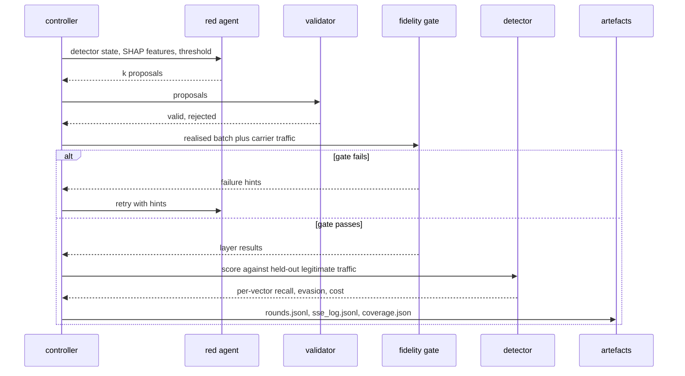

---

## State management

There is no global store. Every page is a React Server Component that reads its artefacts at build time; the only client components are the ones that need interaction, and each holds its own `useState`.

**Why not Redux.** A store solves cross-component shared mutable state. This application has none: the threshold slider on `/soc` is local to one panel, the replay transport is local to the console, and the filters on `/atlas` are local to the table. Adding a store would introduce a hydration boundary and a serialisation step for state that never leaves its own subtree.

---

## Roadmap

**Phase 1 — close the measurement gaps.** Density-normalised fidelity comparison against an external corpus; a fixed benchmark scored every round so improvement can be separated from rising campaign difficulty; the four graph features currently derivable but unbuilt.

**Phase 2 — production shape.** Measure the feature-store path and publish an end-to-end inline latency; artefact versioning and model rollback beyond file outputs; drift monitoring against live traffic rather than against the loop's own campaigns.

**Phase 3 — coverage.** Injectors for the twenty documented-only vectors, starting with the media-layer group; a streaming Channel B at production lag; an operations review of whether the reason codes are actionable.

---

## Acknowledgements

Sparkov Data Generation by Brandon Harris; the ULB Machine Learning Group credit-card dataset; IBM's synthetic AML benchmark by Altman et al. Public corpora are used as external references, and their provenance is stated in [`weights/MODEL_CARD.md`](weights/MODEL_CARD.md): only ULB is observed transaction data.

---

## Citation

```bibtex
@software{scotoma2026,
  title  = {Scotoma: A Closed Adversarial Loop for Measuring Fraud-Detection Blind Spots},
  author = {{Team Scotoma}},
  year   = {2026},
  url    = {https://github.com/mridulbansal4/Scotoma}
}
```

---

## License

MIT.

---

<div align="center">

**SCOTOMA** — Generate → Gate → Detect → Measure.

</div>
